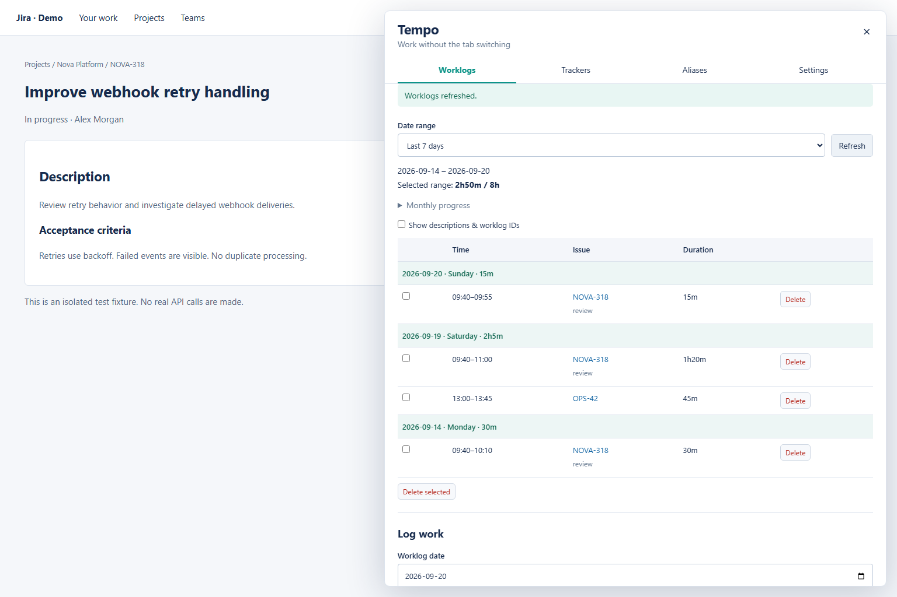
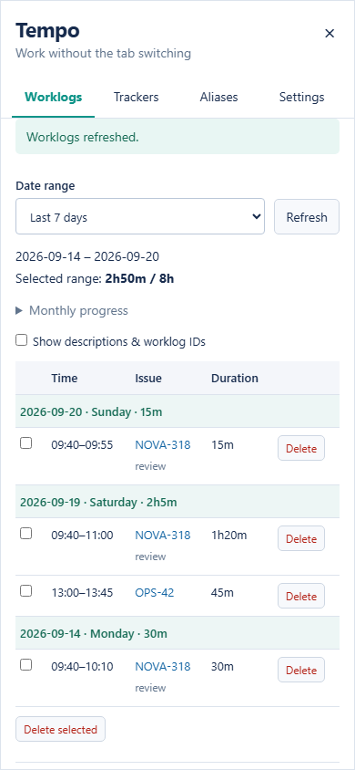

# Tempo for Jira

A Tampermonkey userscript that puts Tempo worklogs, schedules and time trackers inside Jira Cloud. No server, CLI or npm installation is needed to use it.

**[Install the userscript](https://raw.githubusercontent.com/contione/tampermonkey-userscript/main/dist/tempo.user.js)**

## Preview

The actual userscript panel, shown with fictional Jira issues and sample worklogs in an isolated demo.

### Desktop

View your recent worklogs grouped by date and schedule totals, then log time without leaving the current issue.



### Narrow screens

The panel grows with your browser window to give the worklog table more room. On narrow screens it fills the available width and scrolls vertically to keep all controls accessible.



## Installation

1. Install [Tampermonkey](https://www.tampermonkey.net/) from your browser's official extension store.
2. Open the install link above and choose **Install** in Tampermonkey.
3. Visit your Jira Cloud site, such as `https://your-team.atlassian.net`.
4. Click the **Tempo** button halfway down the right edge of the page, then open **Settings**. It stays clear of Jira's Rovo button in the bottom-right corner.

On Chromium browsers, enable the userscript execution option requested by Tampermonkey (depending on the browser version, **Allow user scripts** or extension **Developer mode**). See [Tampermonkey's instructions](https://www.tampermonkey.net/faq.php) if the button does not appear. Refresh Jira after installing.

## Connect your accounts

Enter your Jira email, Jira API token and Tempo API token. The current Jira hostname is detected from the page; `/rest/api/3/myself` discovers your account ID automatically. Both Jira identity and Tempo schedule access are checked before saving.

- Create a Jira **API token without scopes** at [Atlassian account security](https://id.atlassian.com/manage-profile/security/api-tokens). Scoped tokens use a different gateway and are not supported by this version.
- Create a Tempo token in **Tempo Settings → Data Access → API integration** with the permissions needed to read and manage your worklogs.
- Use tokens for the same Jira account and site.

Tokens are stored in **Tampermonkey's script storage**, isolated by Jira hostname. They are not embedded in the userscript, committed to this repository, stored in the Jira page's `localStorage`, or sent to a third-party server. They are sent only to your Jira site and `api.tempo.io` for the requested operations. This local storage is not an encrypted password vault. Keep your browser profile and extension backups private.

Saved token fields remain blank. Leave them blank to keep existing tokens, or enter replacements and select **Verify & save**. **Remove credentials** forgets this site's tokens while keeping aliases and trackers. Data does not sync with the separate CLI or automatically between browsers.

## Worklogs

- The list opens on **Last 7 days**, including today, with the newest date first. Each daily heading shows the date, weekday and total logged time.
- Choose **This week** or **Last week** for a Monday-to-Sunday range. Preset changes refresh the list automatically.
- Choose **Custom**, pick **From** and **To** using the calendar controls, then select **Apply dates**. Both dates are inclusive.
- The range summary shows logged and scheduled hours for the displayed dates. Expand **Monthly progress** for full-month totals, shown separately for every month touched by the range.
- **Worklog date** in **Log work** is a separate calendar picker that defaults to today. Changing the list range does not change this date. Saving outside the displayed range shows a notice and keeps your current filter.
- Log a duration such as `45m` or `1h20m`, or an interval such as `09:40-11:00`.
- Add a description, optional start time and remaining estimate (`0h` is supported).
- Use the current Jira issue, type an issue key, or use an alias.
- Fill in **Work attributes** such as **Task (required)** when your Tempo site requires them. These fields are loaded from Tempo; dropdowns show the configured labels and submit their stored values.
- Show descriptions and worklog IDs, delete one worklog, or select multiple rows to delete together. Deletions require confirmation.

Issue links point back to your Jira site. If an issue cannot be read, its numeric ID remains visible instead of hiding the entire worklog list. Summary values are calculated from the API response, not sample data.

If you see `Work attribute Task (Task) is required`, update the userscript and refresh Jira, then choose or enter **Task** under **Work attributes** before saving. This is a Tempo worklog field, separate from the Jira issue key. Required fields are checked before uploading. If attributes cannot be loaded, check that the Tempo token has permission to read work attributes and use **Load work attributes** to retry; existing worklogs can still be viewed. Attribute selections stay in the current panel only. Text, numeric, checkbox and static dropdown fields are supported; account fields accept a Tempo account key, and other field types accept their raw Tempo value.

## Trackers and aliases

Start, pause, resume, stop and discard trackers in **Trackers**. Trackers persist when the page or browser is closed; elapsed time continues until you pause or stop them. Durations follow the browser's local timezone.

**Stop & log** uploads each saved interval of at least one minute. Successfully uploaded intervals are removed immediately; failed intervals remain paused. A later stop retries the remaining intervals. If a POST times out, check Tempo first: the server might have saved it even though the response was lost. Creation requests are never automatically retried.

Use **Stop previous** to finish a tracker before starting another for the same issue. If an upload fails, the old tracker stays available and the new one is not started. Stop options can override the description and set a remaining estimate for each submitted interval.

Choose any required work attributes under **Stop options** before **Stop & log** or **Stop previous**. The chosen values apply to each uploaded interval. Missing values leave the tracker intervals paused and available to retry.

Aliases map a short name such as `review` to `NOVA-318`. They work in both worklog forms and trackers.

Writes are serialized across tabs for the same Jira site using the browser's Web Locks API. Keep a current browser version. Closing a tab while a remote write is in flight can still leave an uncertain server result; inspect Tempo before retrying.

## Updates

Tampermonkey checks the published metadata according to its own update settings. A newer `@version` installs the updated script from this repository; existing settings and trackers remain in script storage. You can also use Tampermonkey's **Check for updates** action.

## Development

Requires Node.js 22.12+.

```sh
npm ci
npx playwright install chromium
npm run check
```

- `src/api.ts` / `src/http.ts`: Jira and Tempo clients through `GM_xmlhttpRequest`.
- `src/domain.ts`: time parsing, aliases and pure tracker transitions.
- `src/store.ts`: per-site persistence and serialized writes.
- `src/main.ts` / `src/styles.ts`: isolated Shadow DOM panel.
- `dist/tempo.user.js`: self-contained installable build, with no remote runtime dependencies.

Unit tests use mock transports. Browser tests load the built script with an isolated GM bridge and simulated Jira/Tempo data. They never submit real worklogs. Actual token permissions and Tampermonkey installation should also be checked in your own Jira environment.

CI checks types, unit tests, the generated bundle and browser interactions. To release, bump `package.json`'s version, run `npm run build`, and commit the generated files in `dist`. Pushing `main` updates the public installation URL. Tagging `vX.Y.Z` creates a GitHub Release with the userscript attached. npm credentials are not required.

## License

[MIT](LICENSE).
